<p align="center">
  
</p>

<h1 align="center">Shift</h1>

<p align="center">
  <em>Your workout. Your way.</em>
</p>

<p align="center">
  A modern, offline-first workout tracker for iPhone, iPad, and Apple Watch.<br>
  Built entirely with SwiftUI.
</p>

<p align="center">
  
  
  
  
  
</p>

<br>

> [!NOTE]
> This project is under active development and has not yet been released on the App Store. Features, UI, and architecture are subject to change.

<br>

<p align="center">
  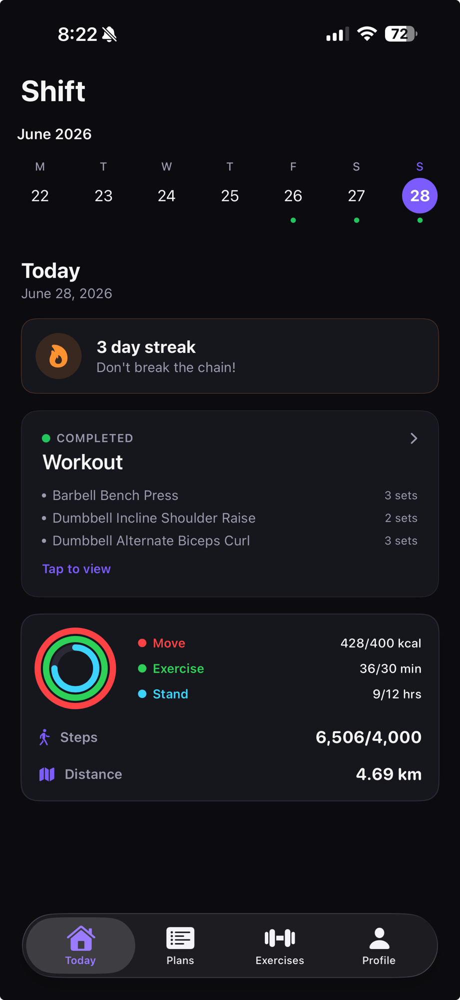
  &nbsp;
  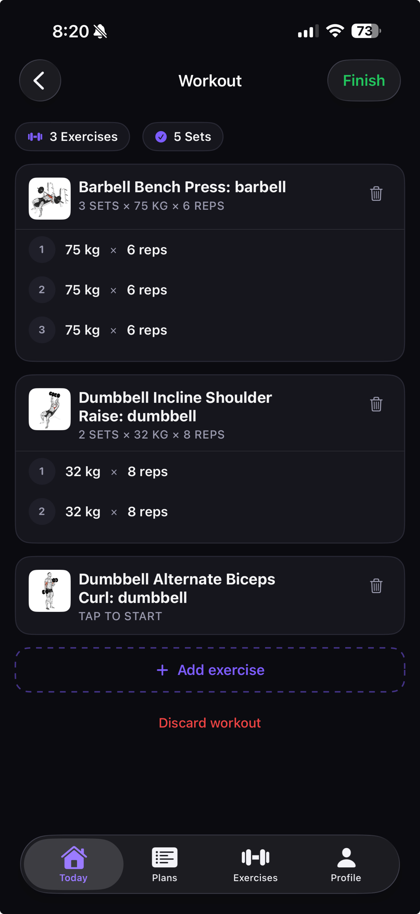
  &nbsp;
  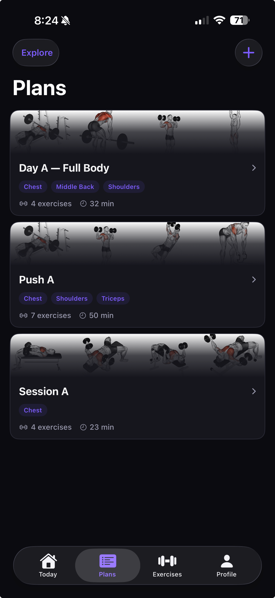
  &nbsp;
  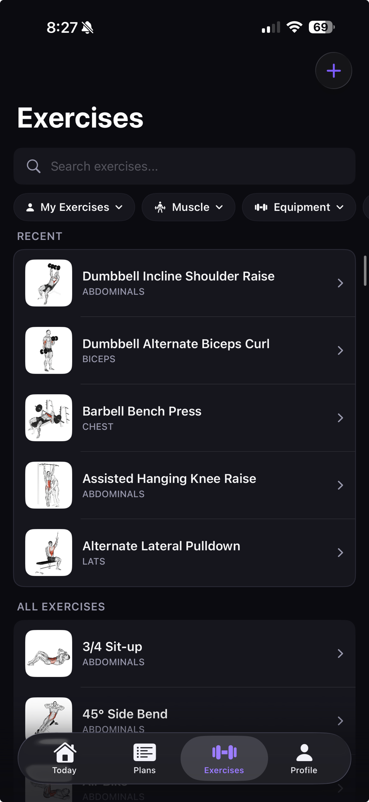
</p>

<br>

---

<br>

## Workout Tracking

Log every set with weight, reps, and RPE. Shift supports normal sets, warm-up sets, drop sets, and supersets — with a built-in rest timer that shows as a Live Activity on your lock screen. Add exercises mid-workout, attach notes, and share a summary card when you're done.

<p align="center">
  
  &nbsp;&nbsp;
  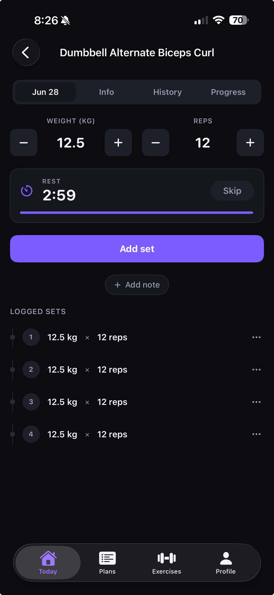
</p>

<br>

## Plans

Create workout plans with drag-to-reorder exercises, target sets, rep ranges, rest periods, and weight targets. Browse a library of pre-made templates — from 3-day full body programs to 6-day PPL splits — or build your own from scratch.

<p align="center">
  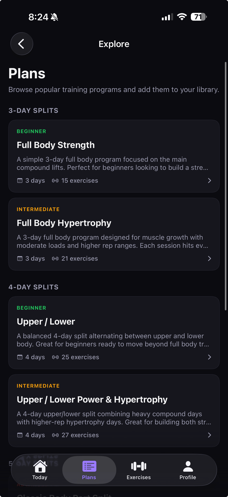
  &nbsp;&nbsp;
  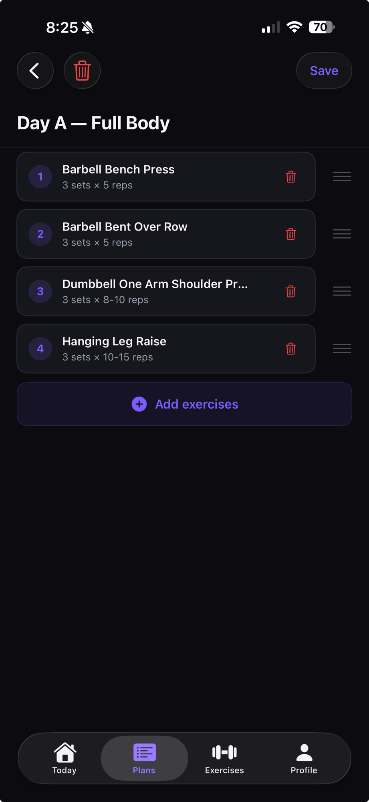
  &nbsp;&nbsp;
  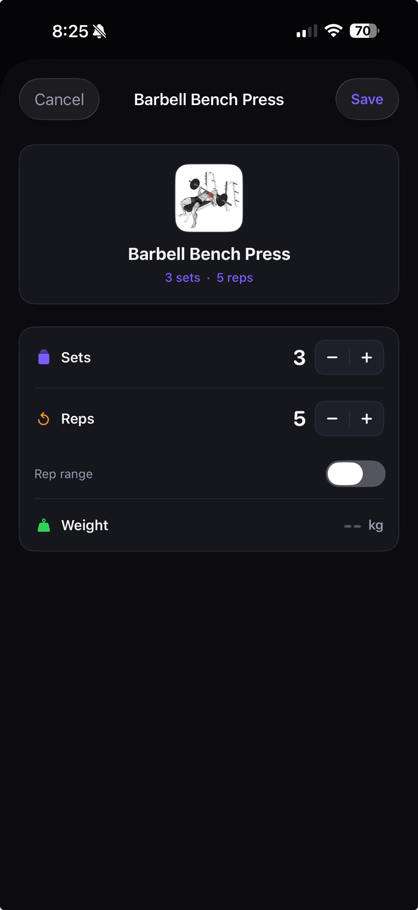
</p>

<br>

## AI Plan Generation

Generate personalized workout plans on-device using Apple's Foundation Models (iOS 26+). A guided wizard walks through your goals, schedule, experience level, and preferences — including voice input for injuries and equipment notes. Everything runs locally for privacy.

**Goal types:** Build Muscle · Increase Strength · Tone & Define · General Fitness · Improve Endurance · Athletic Performance · Rehab · Body Recomposition

<br>

## Exercise Library

A comprehensive built-in database with illustrated instructions, muscle targets, and equipment info. Filter by muscle group, equipment, or difficulty. Create custom exercises, track personal bests, and set exercise-specific goals.

<p align="center">
  
</p>

<br>

## Progress Tracking

Track your progress across three dimensions:

- **Weight** — log entries, visualize trends over time, set a target weight with a deadline
- **Measurements** — chest, waist, arms, thighs, calves, neck *(Pro)*
- **Photos** — progress photo capture with before/after comparison, protected with Face ID *(Pro)*

<p align="center">
  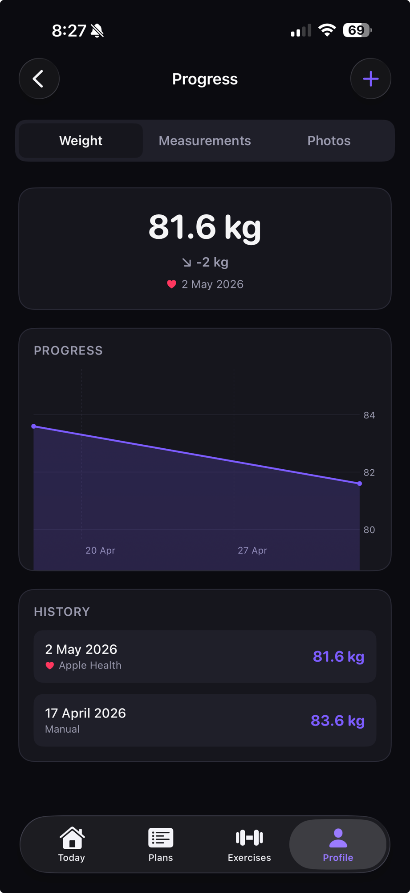
</p>

<br>

## Today

The home screen gives you everything at a glance: a week calendar with workout indicators, your current streak, completed sessions, and a HealthKit activity card showing move calories, exercise minutes, stand hours, steps, and distance.

<p align="center">
  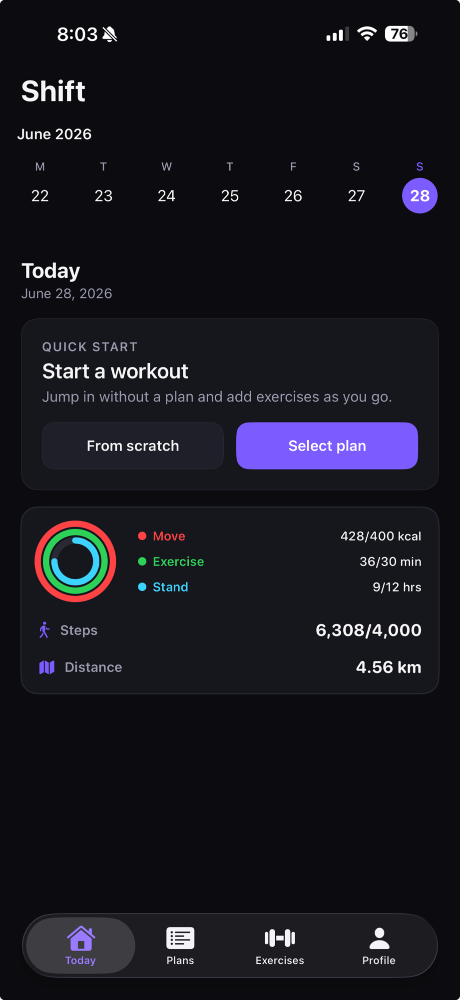
  &nbsp;&nbsp;
  
</p>

<br>

## Apple Watch

Start and log workouts from your wrist, or continue an active iPhone workout on the watch. Features a rest timer, live step count, workout summary, and two-way sync via WatchConnectivity. Watch complications show workout progress and daily steps on your watch face. *(Pro)*

<br>

## Widgets

Home screen widgets keep you on track without opening the app:

| Widget | What it shows |
|---|---|
| Today's Activity | Steps, workouts, streak at a glance |
| Streak Counter | Current streak with flame icon |
| Step Counter | Daily step progress |
| Weekly Progress | Workouts completed vs. goal |
| Quick Start | One-tap workout launch |

<br>

## Smart Notifications

An intelligent notification engine schedules reminders based on your goals — exercise targets, weekly frequency nudges, step milestones (50%, 75%, 100%), and progress tracking prompts for weight, measurements, and photos.

<br>

## HealthKit

Sync completed workouts and body weight to Apple Health. Import step count, active energy, exercise time, and stand hours. Background step monitoring keeps your goal tracking up to date in real time. Optionally count workouts from other fitness apps.

<br>

---

<br>

## Pro

Shift is free for core workout tracking. A Pro subscription unlocks the full experience:

<p align="center">
  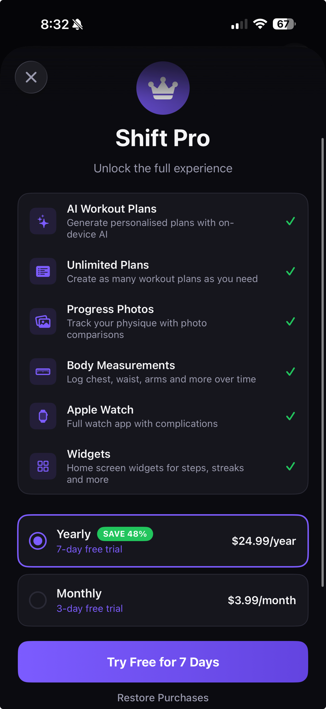
</p>

| | Free | Pro |
|---|:---:|:---:|
| Workout tracking & logging | ✓ | ✓ |
| Exercise library & custom exercises | ✓ | ✓ |
| Weight tracking & graphs | ✓ | ✓ |
| Workout plans | 3 | Unlimited |
| AI plan generation | | ✓ |
| Progress photos (Face ID) | | ✓ |
| Body measurements | | ✓ |
| Apple Watch app | | ✓ |
| Watch complications | | ✓ |
| Home screen widgets | | ✓ |

<br>

---

<br>

## Architecture

```
Shift/
├── App/                    # Entry point and root navigation
├── Models/                 # Data models and database records
├── Views/
│   ├── Auth/               # Sign in, sign up
│   ├── Onboarding/         # 9-step guided setup
│   ├── Today/              # Home dashboard
│   ├── Workout/            # Live workout logging
│   ├── Plans/              # Plan building and AI generation
│   ├── Exercises/          # Exercise library
│   ├── Progress/           # Weight, measurements, photos
│   ├── Profile/            # Goals and personal bests
│   └── Settings/           # Preferences and account
├── Services/               # Business logic
├── Repositories/           # GRDB database access
├── Database/               # Schema and migrations
├── Components/             # Reusable UI components
├── Helpers/                # Utilities and managers
├── Connectivity/           # WatchConnectivity bridge
└── Theme/                  # Color system and design tokens
ShiftWatch/                 # Apple Watch companion
ShiftTimerWidget/           # Widgets + Live Activity
ShiftWatchComplications/    # Watch face complications
Shared/                     # Shared models between targets
```

<br>

### Tech Stack

| | |
|---|---|
| **UI** | SwiftUI + `@Observable` |
| **Database** | GRDB 7.10 (SQLite) |
| **Backend** | Supabase (auth, sync, RLS) |
| **Subscriptions** | StoreKit 2 |
| **Health** | HealthKit |
| **Watch** | WatchConnectivity |
| **Widgets** | WidgetKit + ActivityKit |
| **AI** | Apple Foundation Models (iOS 26+) |

<br>

### Offline-First

The local GRDB database is the source of truth. A mutation queue stores changes and flushes them to Supabase when connectivity is available, with FIFO processing to maintain order. The app is fully functional without an internet connection.

<br>

---

<br>

## Status

This app is a **work in progress**. Current focus areas:

- [ ] Final UI polish and refinements
- [ ] App Store submission preparation
- [ ] Additional explore/template plans
- [ ] Expanded exercise library content
- [ ] Performance optimization

Feedback and ideas are welcome — feel free to [open an issue](../../issues).

<br>

## License

This project is proprietary. All rights reserved.
